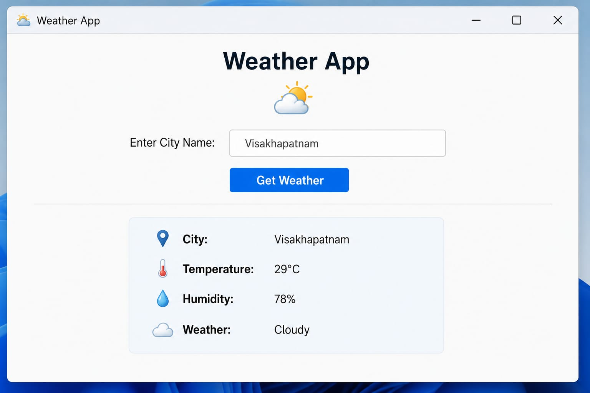
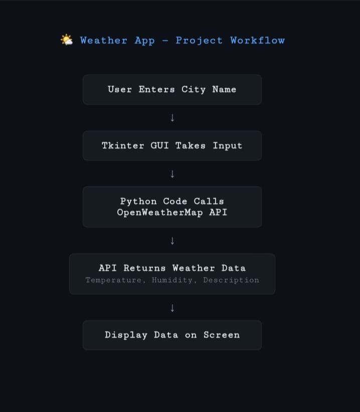

# 🌤️ Weather App - Python

A simple Python weather application that shows real-time weather data for any city using OpenWeatherMap API.

## ✨ Features
- Get current temperature in Celsius
- Shows "Feels like" temperature  
- Weather description like "clear sky", "cloudy"
- Humidity and Wind Speed details
- Simple command line interface

## 🛠️ Tech Stack
- **Language**: Python 3
- **API**: OpenWeatherMap API
- **Library**: requests

## 📦 Installation

1. Clone the repo
```bash
git clone https://github.com/your-username/your-repo-name.git
cd your-repo-name
pip install -r requirements.txt
## 🚀 How to Run
```bash
python weather_app.py
Enter city name and get instant weather info!

## 📸 Screenshot


## 🔄 Workflow


## 📄 License
MIT License
